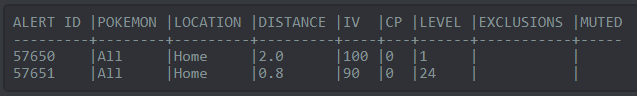

## Filters
You will have a list of filters, and will receive an alert if a new spawn matches **any** of them. Within each individual filter you set, you will receive an alert if the spawn matches **all** the parameters – IV, CP, distance and such. You can **add**, **edit** and **remove** them. You can also enable/disable them temporarily without editing them (all filters are enabled at first) – see **Muting/Unmuting Filters**.

Contents:
1. [**Viewing Filters**](#1-viewing-filters)  
2. [**Adding Filters**](#2-adding-filters)
3. [**Editing Filters**](#3-editing-filters)
4. [**Removing Filters**](#4-removing-filters)
5. [**Muting/Unmuting Filters**](#5-mutingunmuting-filters)

---

### 1. Viewing Filters
```
!alert show
```
Shows a list of filters, and shows which is active. It's the go-to to see what's going on with filters. Example:



```
!alert show name
!alert show number
```
Shows a list of filters, sorted by name or by (dex) number.

---

### 2. Adding Filters
```
!alert pokemon=<name> distance=<distance> iv=<iv> cp=<cp> level=<level> exclude=<exclusions>

!alert pokemon=dratini distance=1.5 iv=90
!alert pokemon=all distance=2 iv=100 exclude=sentret,marill
```
Adds a new filter. The first line is the general syntax (scroll by sliding your finger to see all of it!). **These are the parameters:**.

* **`<name>`** [compulsory]: Here, you can specify a single Pokémon by name or a built-in group. These are the groups:
    * `all` – refers to all Pokémon.
    * `gen1`, `gen2`, `gen3` – refers to all Pokémon in a generation.
    * `ultra common`, `common`, `uncommon`, `rare`, `ultra rare` – refers to rarity tiers of Pokémon as decided by the admins. To see what's in each tier, send Arceus the command `!rarity <tier-name>` – e.g. `!rarity ultra rare`.

* **`<distance>`** [compulsory]: A whole number specifying max distance from active location, interpreted in km. **Note:**
    * Don't type `km`; just the number will do!

* **`<iv>`**, **`<cp>`**, **`<level>`** [optional]: Whole numbers specifying min IV (as a percentage), CP, level. **Note**:
    * You **cannot specify all 3 of these in a single filter**; between 0 and 2 of them is fine.

* **`<exclusions>`** [optional]: If you've chosen a group for `<name>`, you can exclude individual Pokémon from it by providing a comma-separated list here, either a list of names (may include rarity groups) or a list of dex numbers. **Note:**
    * `<exclusions>` has a **750-character limit**, so it's safe to have fewer than 60 Pokémon or groups. This goes even if listing by number, because the numbers are converted into names before the limit is applied.
    * **Only rarity groups may be excluded**; excluding other groups such as `all` or `gen1` will silently fail!
    * You **can't mix names and numbers** in a single `<exclusions>` list.
    * If listing by number, **do not include any spaces**.

Now, **note two general details:**
* Though you may omit optional parameters, you must **stick to the order** of parameters as outlined above.
* **Do not include spaces around any `=` sign**, and take care to include only one space between separate parameters (basically, delete any extraneous spaces :P).
---

### 3. Editing Filters
To edit filters, run `!alert show` so you have a list of filter (alert) IDs to hand. They're listed in the left column:


```
!distance <alertID> <newDistance>
!iv <alertID> <newIV>
!cp <alertID> <newCP>
!level <alertID> <newLevel>
!exclude <alertID> <newExclusions>

!distance 57650 2.5
!iv 57650 96
!cp 57650 2000
!level 57650 20
!exclude 57650 gen1,sentret
```
Edits a parameter for a filter by its ID. For details about how each parameter works, refer to **§2. Adding Filters**.

```
!exclude <alertID> none
```
Completely removes exclusions for a filter by its ID.

---

### 4. Removing Filters
To remove filters, run `!alert show` so you have a list of filter (alert) IDs to hand. They're listed in the left column:


```
!alert remove <alertID>
!alert remove 57650
```
Removes a filter by its ID.
```
!alert remove all
```
Removes all filters. Start afresh!

---

### 5. Muting/Unmuting Filters
This temporarily disables/re-enables filters, without editing/removing them. First, run `!alert show` so you have a list of filter (alert) IDs to hand. They're listed in the left column:


```
!alert mute <alertID>
!alert unmute <alertID>

!alert mute 57650
!alert unmute 57650
```
Mutes/unmutes a particular filter.
```
!alert mute all
!alert unmute all
```
Mutes/unmutes all filters.